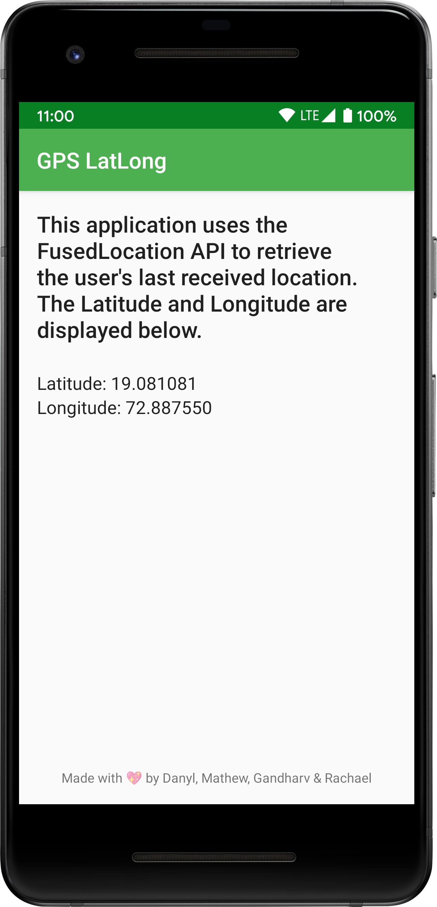

# GPS LatLong

  

* A simple Android app that uses the FusedLocation API.
* The last known Latitude and Longitude of the device are displayed.

# Technicals

* Written in Kotlin.
* Using Material Theme Components.

# Screenshots

  

# Download 

<a href="https://github.com/grewscant/gpslatlong/raw/master/app/release/app-release.apk">Click here to download the APK!</a>

